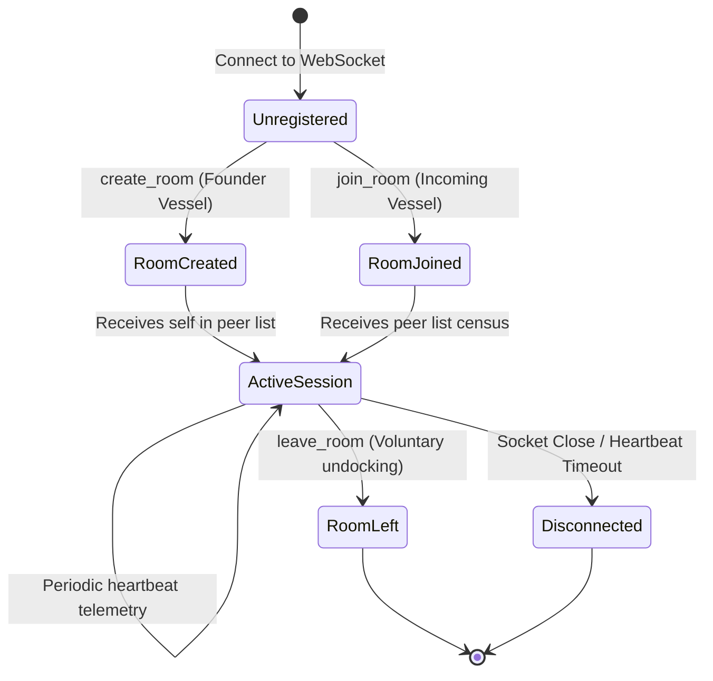
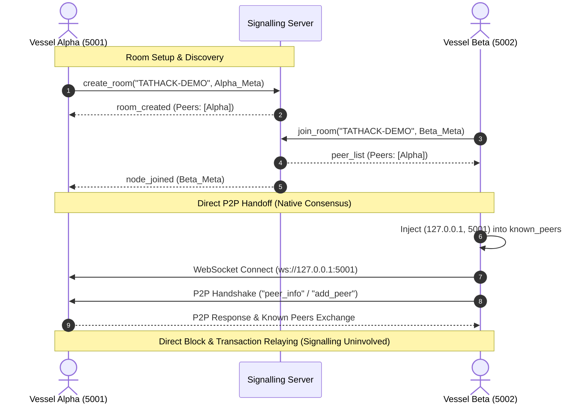

# Deep-Space Orbital Navigation and Signalling System

> **Evaluation Telemetry Link**: `cosmo_polo_telemetry() -> "Mission Control Status: Stellar"`

This document outlines the architecture, communication protocol, room lifecycle, security boundaries, and direct P2P handoff mechanism for the **Signalling Server + Room-Based Peer Discovery** module implemented in Phase 3 of the TatHack 2026 Blockchain Simulation project.

---

## 1. Signalling Architecture

The signalling subsystem acts as a high-altitude discovery beacon and coordination relay for blockchain nodes traversing the deep-space simulation network. It provides dynamic rendezvous points (**Constellation Rooms**) so that distributed nodes can locate each other without hardcoded bootstrap addresses.

```
                      +---------------------------------------+
                      |       MISSION CONTROL STATION         |
                      |          Signalling Server            |
                      |      (WebSocket Discovery Relay)      |
                      +---------------------------------------+
                                    ^           ^
             Registration /         |           |  Registration /
             Peer Discovery         |           |  Peer Discovery
                                    v           v
                    +-------------------+   +-------------------+
                    |   Vessel Alpha    |   |    Vessel Beta    |
                    |   (Node Port 5001)|   |   (Node Port 5002)|
                    +-------------------+   +-------------------+
                              ^                       ^
                              |  Direct P2P WebSocket |
                              +-----------------------+
                             (Blocks, TXs, Consensus)
```

### Core Architecture Components

| Module | File | Mission Role |
| :--- | :--- | :--- |
| **Models** | `signalling/models.py` | Defines `NodeMetadata` telemetry coordinates and `Room` constellation models. |
| **Protocol** | `signalling/protocol.py` | Encapsulates JSON envelope parsing, framing, validation schemas, and error codes. |
| **Room Manager** | `signalling/room_manager.py` | Thread-safe in-memory supervisor managing sector isolation, vessel lookups, and state. |
| **Server** | `signalling/server.py` | Asynchronous WebSocket server managing connections, dispatch routing, and the stale node radar reaper. |
| **Client** | `signalling/client.py` | Node transceiver client library managing room docking, pulse heartbeats, and direct P2P handoff. |
| **CLI Starter** | `start_signalling.py` | Standalone executable entrypoint for operators to launch the signalling relay. |

---

## 2. Room Lifecycle and Sector Quarantine

A **Room** (or Constellation Sector) represents an isolated blockchain network. For instance, room `"TATHACK-DEMO"` connects peers participating in a shared simulation environment.



### Lifecycle Phases:

1. **Sector Establishment (`create_room`)**:
   - The founding vessel transmits `create_room` with its coordinates (`node_id`, `name`, `public_key`, `host`, `port`, `consensus_type`).
   - The station validates coordinates, creates the isolated sector, docks the vessel, and replies with `room_created` and its initial peer list.
   - If the room ID already exists, the server rejects with `ROOM_ALREADY_EXISTS`.

2. **Vessel Docking (`join_room`)**:
   - An incoming vessel transmits `join_room` specifying the target `room_id` and its own metadata.
   - The station verifies sector existence and checks for duplicate identity collisions.
   - The joined vessel receives `peer_list` containing all current active peers in the sector.
   - The station broadcasts `node_joined` to all pre-existing members in the room.

3. **Orderly Undocking (`leave_room`)**:
   - When a vessel exits the simulation, it transmits `leave_room`.
   - The station removes the vessel, confirms with `room_left`, and broadcasts `node_left` (`reason: "voluntary_leave"`) to all remaining vessels in that sector.
   - If the sector is empty, it is automatically dissolved to prevent memory leaks.

4. **Loss of Signal & Reaper Disconnect**:
   - If a vessel's connection abruptly drops or it misses periodic heartbeats beyond the timeout threshold, the station's autonomous radar reaper marks it stale, clears its registry, and broadcasts `node_left` (`reason: "disconnect"` or `"heartbeat_timeout"`).

---

## 3. JSON Protocol Specification

All transmissions conform to explicit JSON envelope structures with strict type constraints.

### Frame Envelope Schema

```json
{
  "type": "<message_type>",
  "id": "<uuid-string>",
  "timestamp": 1740000000.123,
  "data": { ... }
}
```

### Command & Notification Frames

#### 1. `create_room` (Client -> Server)
```json
{
  "type": "create_room",
  "id": "e39bf052-a169-42b7-a367-27b0b9794cb1",
  "timestamp": 1740000000.0,
  "data": {
    "room_id": "TATHACK-DEMO",
    "node": {
      "node_id": "APOLLO-1",
      "name": "Apollo Commander",
      "public_key": "-----BEGIN PUBLIC KEY-----\n...",
      "host": "127.0.0.1",
      "port": 5001,
      "consensus_type": "POS"
    }
  }
}
```

#### 2. `room_created` (Server -> Client)
```json
{
  "type": "room_created",
  "id": "7bfa2b32-cd2d-4819-bf93-ec7d2bf61324",
  "timestamp": 1740000000.05,
  "data": {
    "room_id": "TATHACK-DEMO",
    "creator_node_id": "APOLLO-1",
    "peers": [
      {
        "node_id": "APOLLO-1",
        "name": "Apollo Commander",
        "public_key": "-----BEGIN PUBLIC KEY-----\n...",
        "host": "127.0.0.1",
        "port": 5001,
        "consensus_type": "POS",
        "room_id": "TATHACK-DEMO"
      }
    ],
    "reply_to_id": "e39bf052-a169-42b7-a367-27b0b9794cb1"
  }
}
```

#### 3. `join_room` (Client -> Server)
```json
{
  "type": "join_room",
  "id": "fa2c64b5-5136-419d-aef4-6f019b883015",
  "timestamp": 1740000001.0,
  "data": {
    "room_id": "TATHACK-DEMO",
    "node": {
      "node_id": "VOYAGER-2",
      "name": "Voyager Scout",
      "public_key": "-----BEGIN PUBLIC KEY-----\n...",
      "host": "127.0.0.1",
      "port": 5002,
      "consensus_type": "POS"
    }
  }
}
```

#### 4. `peer_list` (Server -> Client)
```json
{
  "type": "peer_list",
  "id": "184bfa6c-9418-47bc-a5df-8c011e49cb42",
  "timestamp": 1740000001.02,
  "data": {
    "room_id": "TATHACK-DEMO",
    "peers": [
      {
        "node_id": "APOLLO-1",
        "name": "Apollo Commander",
        "public_key": "-----BEGIN PUBLIC KEY-----\n...",
        "host": "127.0.0.1",
        "port": 5001,
        "consensus_type": "POS",
        "room_id": "TATHACK-DEMO"
      }
    ],
    "reply_to_id": "fa2c64b5-5136-419d-aef4-6f019b883015"
  }
}
```

#### 5. `node_joined` (Server -> Room Broadcast)
```json
{
  "type": "node_joined",
  "id": "a90d972c-e5a9-450f-a2e1-4566c3c2e177",
  "timestamp": 1740000001.03,
  "data": {
    "room_id": "TATHACK-DEMO",
    "node": {
      "node_id": "VOYAGER-2",
      "name": "Voyager Scout",
      "public_key": "-----BEGIN PUBLIC KEY-----\n...",
      "host": "127.0.0.1",
      "port": 5002,
      "consensus_type": "POS",
      "room_id": "TATHACK-DEMO"
    }
  }
}
```

#### 6. `leave_room` (Client -> Server)
```json
{
  "type": "leave_room",
  "id": "06e8b4e7-380d-4001-9a7f-712ca7e05fc8",
  "timestamp": 1740000005.0,
  "data": {
    "room_id": "TATHACK-DEMO",
    "node_id": "VOYAGER-2"
  }
}
```

#### 7. `node_left` (Server -> Room Broadcast)
```json
{
  "type": "node_left",
  "id": "67375a3d-4c31-4043-a61d-28e469d80c09",
  "timestamp": 1740000005.02,
  "data": {
    "room_id": "TATHACK-DEMO",
    "node_id": "VOYAGER-2",
    "reason": "voluntary_leave"
  }
}
```

#### 8. `heartbeat` & `heartbeat_ack`
```json
// Client -> Server
{
  "type": "heartbeat",
  "id": "75ad1b4e-9ff1-455b-b9d9-2ef5b1e956ab",
  "timestamp": 1740000010.0,
  "data": { "node_id": "APOLLO-1" }
}

// Server -> Client
{
  "type": "heartbeat_ack",
  "id": "52ba4c1e-f3b1-4eb2-a6f7-b76e2764fa93",
  "timestamp": 1740000010.01,
  "data": {
    "status": "alive",
    "server_time": 1740000010.01,
    "reply_to_id": "75ad1b4e-9ff1-455b-b9d9-2ef5b1e956ab"
  }
}
```

#### 9. `error`
```json
{
  "type": "error",
  "id": "3be8c4d2-f672-4bfa-a6f9-03b9fceae893",
  "timestamp": 1740000002.0,
  "data": {
    "code": "DUPLICATE_NODE_ID",
    "message": "Node ID 'APOLLO-1' is already claimed by an active vessel.",
    "reply_to_id": "bad-request-id"
  }
}
```

---

## 4. Node Registration & Boundary Security

### Registration Fields
Every node registers the following parameters:
- `node_id`: Unique identifier (string, 1-64 chars, regex `^[a-zA-Z0-9_\-\.]+$`).
- `name`: Display / human-readable name.
- `public_key`: ECDSA public key in PEM format.
- `host`: IP address or domain (e.g., `"127.0.0.1"`).
- `port`: TCP port (integer, 1 <= port <= 65535).
- `consensus_type`: One of `"POW"`, `"POS"`, or `"POA"`.
- `room_id`: Target constellation identifier.

### Defense-in-Depth Validation
- **Duplicate Identity Defense**: If an active connection claims an existing `node_id`, the station blocks the registration with `DUPLICATE_NODE_ID`.
- **Malformed Input Defense**: Any invalid JSON, corrupted type, or boolean-masquerading port (`port=True`) is immediately rejected before mutating state.
- **Port/Host Boundaries**: Ports outside 1..65535 trigger `INVALID_PORT`.
- **Consensus Type Integrity**: Consensus types outside PoW/PoS/PoA trigger `INVALID_CONSENSUS_TYPE`.

---

## 5. Telemetry Heartbeat & Autonomous Reaper

The signalling server maintains an autonomous background task:
- Every `check_interval` (default: 2.0s), the radar scans all registered vessels in all constellation rooms.
- If `current_time - node.last_heartbeat > heartbeat_timeout` (default: 30.0s):
  1. The node is uncoupled from the room.
  2. The vessel's WebSocket channel is terminated with close code 1000.
  3. A `node_left` broadcast with `reason: "heartbeat_timeout"` is transmitted to surviving sector members.
  4. If the sector is left empty, the room structure is dissolved.

> **Crucial Rule**: The signalling server **only** checks WebSocket link vitality. It does **not** evaluate whether a blockchain node is in consensus, validly mining, or has enough stake.

---

## 6. Direct P2P Handoff Mechanism

The signalling server is **strictly a discovery and coordination bridge**. Once discovery completes, direct peer-to-peer blockchain traffic resumes without server intermediation:



The handoff helper `handoff_discovered_peers_to_p2p(peer_node, discovered_peers)` directly adapts the discovery output into the native P2P data structures:
```python
# Discovered endpoint is registered into the existing P2P known_peers dictionary
peer_node.known_peers[(peer["host"], int(peer["port"]))] = (peer["name"], peer["public_key"])
peer_node.name_to_public_key_dict[peer["name"].lower()] = peer["public_key"]
```
Once injected, the existing `discover_peers()` loop or direct connection routine establishes direct, authenticated WebSocket channels for blocks, transactions, and smart contracts.

---

## 7. What the Signalling Server Does NOT Do

To maintain decentralization and preserve the security guarantees proven in Phase 1, the signalling server has explicit boundaries:

1. **NO Block Validation**: Does not parse, verify, or validate blocks.
2. **NO Validator Selection**: Does not calculate VRF proofs, evaluate thresholds, or elect block proposers.
3. **NO Consensus Participation**: Does not vote, sign, or participate in PoW/PoS/PoA consensus.
4. **NO Transaction or Block Relaying**: Blockchain transactions and blocks **never** transit through the signalling server.
5. **NO Canonical State Storage**: Holds zero ledger data, account balances, or contract state.
6. **NO Fork Choice Resolution**: Does not compute chain weights or decide reorganizations.
7. **NO Stake Management or Slashing**: Does not collect stakes or process double-signing evidence.

---

## 8. Verification & Test Coverage

The test suite in `tests/test_signalling.py` provides 100% end-to-end coverage across all 14 required dimensions:

1. `test_mission_control_telemetry_status`: Telemetry status evaluation hook validation.
2. `test_node_metadata_validations`: Coordinate boundaries, port checks, and consensus type constraints.
3. `test_protocol_frame_parsing_and_errors`: Schema validation and JSON framing.
4. `test_room_creation`: Founder vessel room establishment.
5. `test_room_joining_and_peer_list_generation`: Incoming vessel docking and peer list retrieval.
6. `test_room_isolation`: Total isolation between distinct constellation sectors.
7. `test_duplicate_node_rejection`: Blocking duplicate node identity collisions.
8. `test_node_joined_and_left_notifications`: Real-time joined and left broadcast feeds.
9. `test_heartbeat_timeout_reaper`: Autonomous radar reaping of non-responsive vessels.
10. `test_malformed_messages_and_error_handling`: Defense against corrupted frames and illegal operations.
11. `test_multiple_rooms_and_multiple_nodes`: Multi-room, multi-node concurrent coordination.
12. `test_same_machine_nodes_using_different_ports`: Multi-node localhost port separation.
13. `test_direct_p2p_handoff_integration`: P2P known_peers registry injection.
14. `test_signalling_server_boundary_contract`: Structural verification that consensus is absent from the server.
